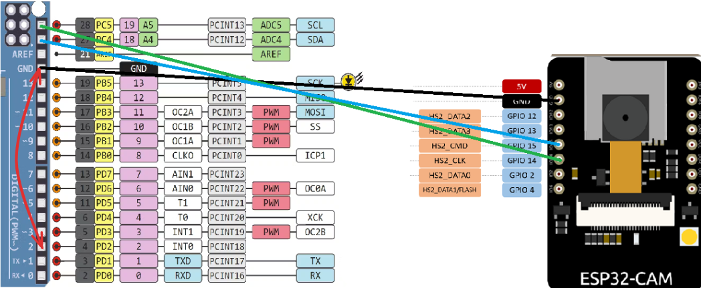

### Remember to not to add your WiFi name or Password before committing.

1. Main Branch --> Basic Setup for WiFi connection.

2. sample-http-GET --> By using `https://jsonplaceholder.typicode.com/posts/` public URL HTTP GET request is send to get random post between 1 and 10.

3. http-GET-deserialization --> Deserialize the data from `https://jsonplaceholder.typicode.com/posts/` integer id and string title.

4. http-POST-request-response --> serialize the request into JSON and the deserialize repose into JSON.

    [Watch this video before start](https://youtu.be/dblfMlRa6qI?si=67M8xsb1UXYhFG5M)

5. take-image-send-http-POST --> send HTTP POST base64 image

    [Watch this video before start](https://youtu.be/z67mfL63e2M?si=etlI8A6lW7rNlzY0)

6. make-process-asynchronous --> sending image and getting back process

    [Go and Decode the Base64 image](https://base64.guru/converter/decode/image)

7. ### setup
   

    ```
    ESP32 (Master)     Arduino (Slave)
    SDA (PIN 15) ----- SDA (A4/SDA)
    SCL (PIN 14) ----- SCL (A5/SCL)
    GND -------------- GND

    Button connection on Arduino:
    Pin 2 ------------ GND (Act as a button)
    ```